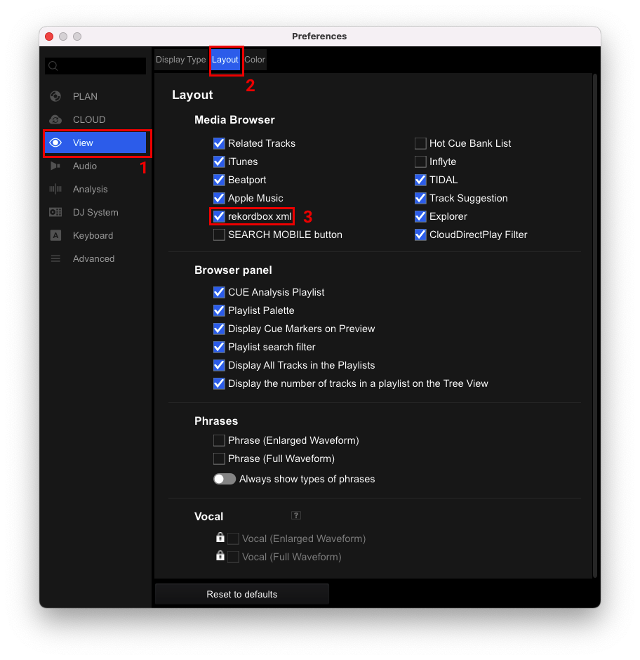
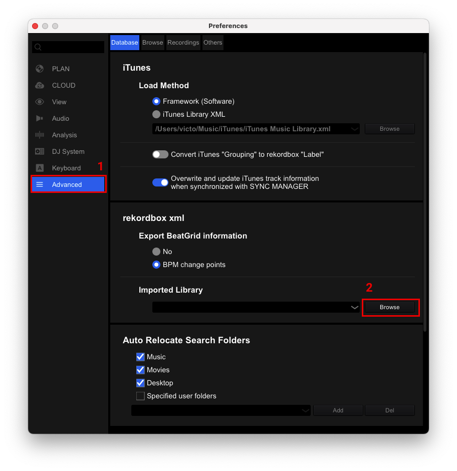
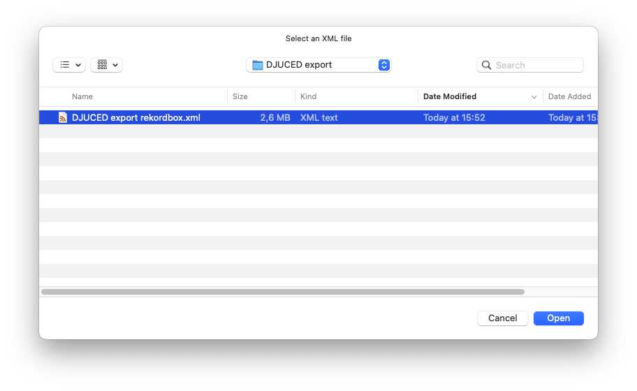
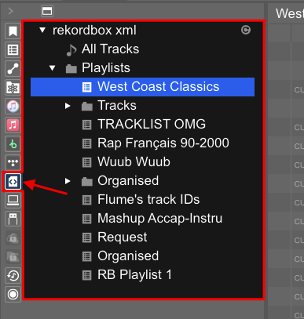

# Import Rau Studio XML into Rekordbox

This guide covers only the import part of the attached reference documentation: how to open the XML exported by Rau Studio in Rekordbox and bring its playlists into your library.

Key point: the XML does not contain embedded audio. Rekordbox reads file paths from each track `Location`, so the original files and `converted/` folders must remain in place.

## 1. Enable the rekordbox xml Panel

The `rekordbox xml` browser panel is not always visible by default.

In Rekordbox, open:

```text
Preferences > View > Layout
```

Enable the `rekordbox xml` checkbox.



## 2. Select the XML Exported by Rau Studio

Without leaving preferences, open:

```text
Advanced > Database
```

In the `Imported Library` section, click `Browse` and select the XML exported from Rau Studio.



When Rekordbox asks for the file, choose the exported XML and click `Open`. You can then close the preferences window.



## 3. Open the XML Library in Rekordbox

In the Rekordbox browser, open the `rekordbox xml` category.

You should see:

- `All Tracks`: every track included in the XML.
- `Playlists`: the exported playlist structure.



If you export the XML again from Rau Studio, use the refresh button next to `All Tracks` to reload it without configuring the XML path again.


## 4. Import Playlists or Tracks

To import a playlist:

1. Open `rekordbox xml`.
2. Open `Playlists`.
3. Right-click the playlist.
4. Choose `Import Playlist`.

Rekordbox creates the playlist inside your library and analyzes tracks if needed.

You can also import individual tracks by right-clicking and choosing `Import To Collection`.

## Rau Studio Notes

- The XML exported by Rau Studio keeps the full collection.
- Tracks that were not converted keep their original `Location`.
- Converted tracks point to `converted/*.aiff`.
- If music is moved or a `converted/` folder is deleted, Rekordbox can show missing files.
- For a first test, import a small playlist before importing a large set.

Original reference from the attached HTML: `https://www.djuced.com/kb/djuced-rekordbox-xml/`.
